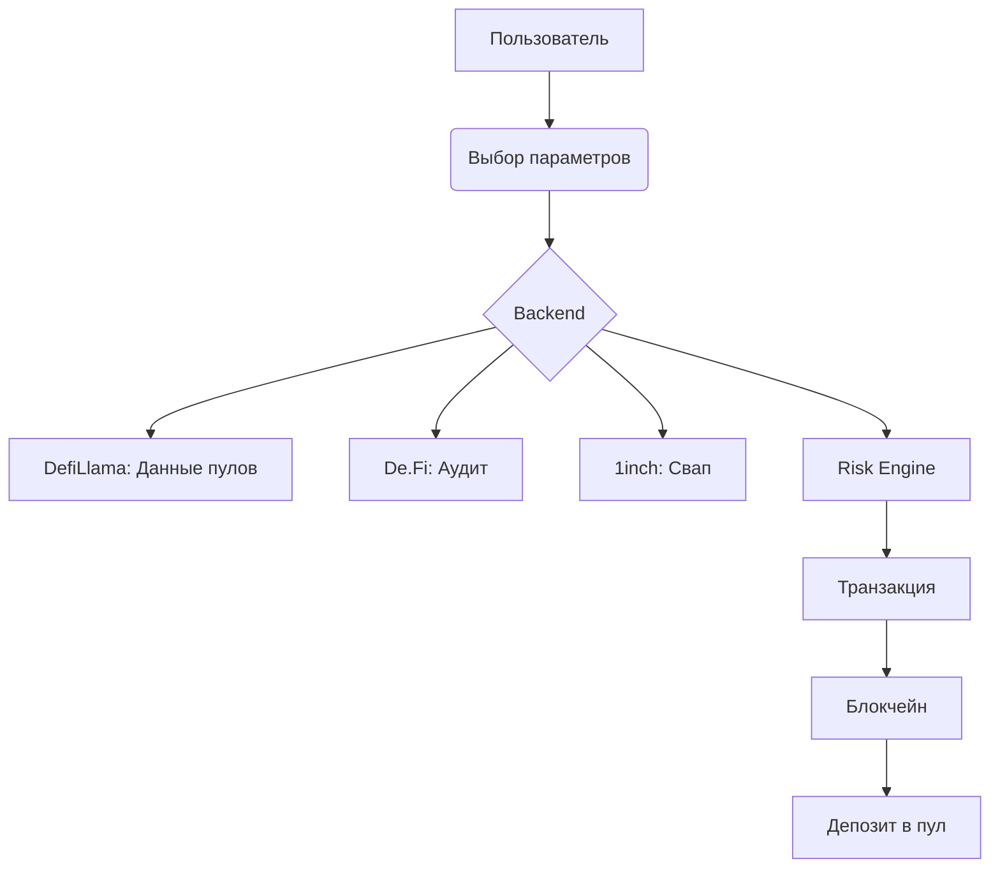
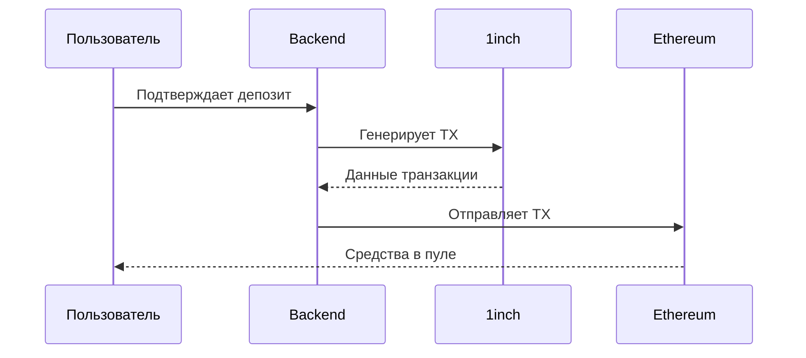
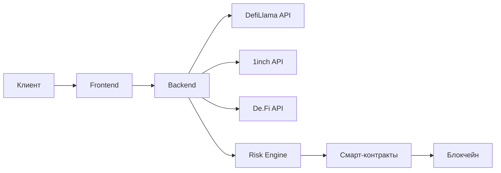

# **DeFi Pilot: One-Click Investment Aggregator**  
## **Полное описание проекта с диаграммами и этапами работы**  

---

## **1. Введение**  
### **1.1. Проблема**  
DeFi предлагает тысячи протоколов с разными APY, но:  
- **Новички теряются** в выборе.  
- **Высокие риски** (скам-пулы, уязвимости).  
- **Сложность** (ручные свапы, approve, мониторинг).  

### **1.2. Решение**  
**DeFi Pilot** — агрегатор, который:  
✅ Автоматически подбирает пулы **под уровень риска**.  
✅ Проверяет контракты **на уязвимости**.  
✅ Позволяет инвестировать **в 1 клик**.  

---

## **2. Как это работает?**  
### **2.1. Общая схема**  


---

## **3. Этапы работы**  
### **3.1. Шаг 1: Пользователь выбирает параметры**  
**Интерфейс запрашивает:**  
- Уровень риска (`Консервативный/Умеренный/Агрессивный`).  
- Блокчейны (`Ethereum, Solana, TON`).  
- Сумму инвестиций (`$100 – $1M`).  

**Пример запроса:**  
```json
{
  "risk": "low",
  "chains": ["ethereum"],
  "amount": 1000
}
```

---

### **3.2. Шаг 2: Анализ пулов**  
**Backend выполняет:**  
1. **Сбор данных** (DefiLlama, 1inch, De.Fi).  
2. **Проверку рисков**:  
   - Аудит контракта (Certik, OpenZeppelin).  
   - Волатильность APY.  
   - Ликвидность (>$1M).  
3. **Фильтрацию** (топ-3 пула).  

**Пример вывода:**  
```json
{
  "pool": "USDC/DAI",
  "apy": 8.5,
  "risk": "low",
  "audit": "Certik"
}
```

---

### **3.3. Шаг 3: One-Click Депозит**  
**Процесс:**  
1. **Свап** токенов через 1inch API.  
2. **Депозит** в пул (Web3.py).  
3. **Транзакция**:  
   - Slippage <1%.  
   - Газ оптимизирован (GasNow).  

**Схема:**  


---

### **3.4. Шаг 4: Мониторинг**  
**После депозита:**  
- **Дашборд** с доходностью.  
- **Уведомления** (Telegram) при:  
  - Падении APY >10%.  
  - Подозрительной активности.  

---

## **4. Техническая реализация**  
### **4.1. Стек технологий**  
| Компонент       | Технологии                     |  
|-----------------|-------------------------------|  
| Frontend        | React, Web3Modal              |  
| Backend         | Python (aiohttp, web3.py)     |  
| Данные          | DefiLlama, 1inch, De.Fi      |  
| Безопасность    | Slither, Forta                |  
| Инфраструктура  | AWS (EC2, KMS), PostgreSQL    |  

### **4.2. Архитектура**  


---

## **5. Безопасность**  
### **5.1. Защита от угроз**  
| Угроза                     | Решение                          |  
|----------------------------|----------------------------------|  
| Скам-пулы                  | Аудит + ручная модерация        |  
| Утечка ключей              | AWS KMS + мультисиг             |  
| Front-running              | Slippage контроль + Flashbots   |  

### **5.2. Политики**  
- **Ключи**: Никогда не хранятся в коде.  
- **Резервы**: 2% от TVL в страховом фонде.  

---

## **6. Бизнес-модель**  
### **6.1. Источники дохода**  
- **Комиссия 0.5%** от депозита.  
- **Партнерские программы** (0.1% от TVL).  

### **6.2. Прогнозы**  
| Метрика       | 2024 (MVP) | 2025       |  
|---------------|------------|------------|  
| Пользователи  | 1,000      | 10,000     |  
| Оборот        | $1M        | $25M       |  

---


## **Заключение**  
**DeFi Pilot** устраняет главные барьеры для массового adoption DeFi:  
🔹 **Простота** (1 клик вместо 10 шагов).  
🔹 **Безопасность** (AI + аудиты).  
🔹 **Доходность** (оптимальные APY).  

