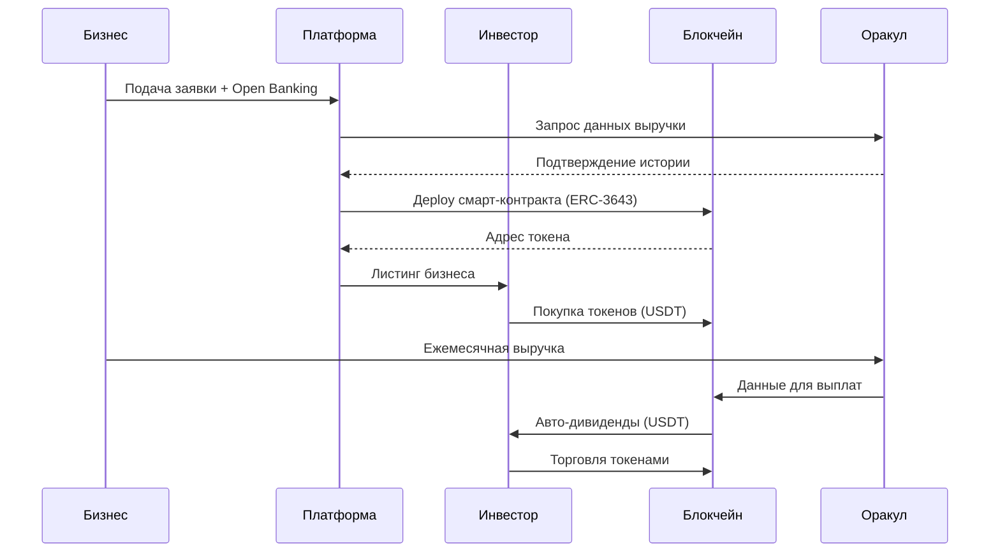

### **Стартап: RWA (Real World Assets) — Токенизация локального бизнеса**  
**Название проекта:** *TokenizeLocal* (или другое запоминающееся, например, *RWA Hub*, *BizToken*, *RevenueShare*)  

---

## **1. Проблема**  
Малый и средний бизнес (кафе, магазины, вендинг, солнечные электростанции и т. д.) сталкивается с проблемами:  
- **Ограниченный доступ к инвестициям** (банки дают кредиты под высокие проценты, венчурные фонды не интересуются малыми проектами).  
- **Географические барьеры** (инвесторы из других стран не могут легко вложиться в локальный бизнес).  
- **Низкая ликвидность доли** (владельцы бизнеса не могут легко продать часть компании).  
- **Отсутствие прозрачности** (инвесторы не доверяют отчетности малого бизнеса).  

---

## **2. Решение**  
**TokenizeLocal** — это платформа для токенизации доли доходов бизнеса в виде цифровых активов (RWA).  

### **Как это работает?**  
#### **Для бизнеса:**  
1. **Регистрация** → Бизнес (например, сеть вендинговых аппаратов) подает заявку на токенизацию.  
2. **Анализ и аудит** → Платформа проверяет финансовую историю через Open Banking API и другие источники.  
3. **Выпуск токенов** → Бизнес выпускает токены, например, **10% от будущей выручки на 3 года**.  
   - Токены выпускаются как **security tokens** (соответствуют регуляциям).  
   - Каждый токен = право на долю в выручке (например, 0,001% от оборота).  
4. **Автоматические выплаты** → Выручка поступает на спецсчет, и дивиденды распределяются в **USDT/USDC** ежемесячно.  

#### **Для инвесторов:**  
1. **Выбор бизнеса** → Инвестор изучает проекты (кафе, солнечные станции и т. д.) на платформе.  
2. **Покупка токенов** → Покупает токены за **USDT/USDC/ETH** (через DEX или напрямую).  
3. **Получение дивидендов** → Автоматические выплаты на кошелек.  
4. **Вторичный рынок** → Токены можно продать на встроенной бирже или через DeFi-пулы.  

---

## **3. Примеры ниш**  
### **1. Вендинговые аппараты в Европе**  
- Бизнес токенизирует **20% выручки** 50 аппаратов.  
- Инвесторы получают **5-15% годовых** в USDT.  
- Автоматический аудит через API банков и данных от аппаратов.  

### **2. Солнечные электростанции в Африке**  
- Токенизация **30% доходов** от продажи энергии.  
- Инвесторы получают доход + помогают развивать "зеленую" энергетику.  

### **3. Магазины и кафе**  
- Локальное кафе выпускает токены под **10% выручки** для расширения.  

---

## **4. Фишки проекта**  
✅ **Юридическая оболочка**  
- Каждый бизнес оформляется через **LLC (ООО) или SPV в Сингапуре/Дубае**.  
- Токены соответствуют **регуляциям (MiCA в ЕС, SEC для США)**.

✅ **DAO для инвесторов**  
- Держатели токенов голосуют за ключевые решения (например, открытие новой точки).  

✅ **Автоматический аудит**  
- **Open Banking API** (подключение к банковским счетам бизнеса).  
- **Оракулы (Pyth Network, Chainlink)** для верификации данных.  

✅ **Низкие комиссии**  
- Блокчейн **Polygon/TON** для дешевых транзакций.  

---

## **5. Монетизация**  
- **3-5% комиссии** от объема привлеченных средств (при выпуске токенов).  
- **1-2% роялти** от оборота бизнеса (ежемесячно).  
- **Плата за листинг** (если бизнес хочет разместиться в топе).  

---

## **6. Технологии**  
🔹 **Блокчейн:** Polygon, TON (дешевые транзакции + масштабируемость).  
🔹 **Смарт-контракты:** Автоматические выплаты дивидендов.  
🔹 **Оракулы:** Pyth Network, Chainlink (данные о выручке).  
🔹 **KYC/AML:** Онбординг через SumSub или аналоги.  
🔹 **Мультичейн:** Возможность выпуска токенов в разных сетях.  

---

## **7. Команда**  
- **CEO** — опыт в fintech/RWA.  
- **CTO** — блокчейн-разработчик (Solidity, Rust).  
- **Юрист** — знание регуляций (MiCA, SEC).  
- **Маркетинг** — привлечение бизнесов и инвесторов.  

---

## **8. Рынок и конкуренты**  
📌 **Аналоги:**  
- **Centrifuge** (токенизация активов).  
- **Maple Finance** (кредитование под залог RWA).  
- **RealT** (токенизация недвижимости).  

📌 **Уникальность TokenizeLocal:**  
- Фокус на **малый бизнес** (не только крупные активы).  
- **DAO + автоматический аудит** (меньше рисков для инвесторов).  

---

---

## **10. Риски и их решение**  
⚠️ **Регуляция** → Работа через юрисдикции с четкими законами (Сингапур, ЕС).  
⚠️ **Мошенничество бизнесов** → Тщательный аудит + страхование через DAO.  
⚠️ **Волатильность крипторынка** → Все выплаты в стейблкоинах.  

---

### **Итог**  
**TokenizeLocal** дает малым бизнесам доступ к глобальным инвестициям, а инвесторам — прозрачный способ вложиться в реальный сектор с пассивным доходом.  

🚀 **Потенциал:** Рынок RWA вырастет до **$10 трлн+** к 2030 году (по данным BCG).  

### **Поэтапное описание работы платформы TokenizeLocal**  
#### **1. AS IS (Текущее состояние малого бизнеса)**  
- Бизнес ищет финансирование через банки/частных инвесторов → высокие ставки, долгий процесс.  
- Инвесторы не могут проверить реальную выручку → низкое доверие.  
- Нет механизма для дробного инвестирования → высокий порог входа.  

#### **2. TO BE (Как будет работать TokenizeLocal)**  

---

### **🔹 Этап 1: Онбординг бизнеса**  
1. **Подача заявки**  
   - Бизнес регистрируется на платформе, указывает:  
     - Нишу (кафе, вендинг, солнечные панели).  
     - Желаемую сумму привлечения (напр., $50k за 10% выручки).  
     - Историю выручки (подключает Open Banking API).  

2. **Due Diligence (KYC + аудит)**  
   - Автоматическая проверка:  
     - Транзакции через **Plaid/Tink** (Европа) или **DirectID** (Азия/Африка).  
     - Кредитная история/налоги через **Creditsafe**.  
   - Ручная модерация (если оборот > $100k/мес).  

3. **Создание юридической оболочки**  
   - Бизнес регистрирует **SPV (Special Purpose Vehicle)** в Сингапуре/Дубае → токены выпускаются от его имени.  

---

### **🔹 Этап 2: Выпуск токенов**  
4. **Настройка смарт-контракта**  
   - Блокчейн: **Polygon** (дешевые gas fees).  
   - Токен стандарта **ERC-3643** (регулируемый security token).  
   - Параметры:  
     - % выручки (напр., 10%).  
     - Срок (напр., 3 года).  
     - Минимальная инвестиция (напр., $100).  

5. **Листинг на платформе**  
   - Страница бизнеса с данными:  
     - Графики выручки (из оракулов).  
     - Прогноз доходности (напр., 12% годовых).  
     - DAO-голосования (например, "Открыть новую точку?").  

---

### **🔹 Этап 3: Привлечение инвесторов**  
6. **Маркетинг и продажа токенов**  
   - Каналы:  
     - Криптосообщество (Twitter, Telegram).  
     - Партнеры (вендинговые операторы, Solar Energy Africa).  
   - Инструменты:  
     - Токенизированные NFT (доказательство инвестиций).  
     - Реферальная программа.  

7. **Покупка токенов**  
   - Инвестор покупает через:  
     - Фастчек (картой через Ramp Network).  
     - Криптовалюту (USDT на Polygon).  

---

### **🔹 Этап 4: Работа токенов**  
8. **Автоматические выплаты**  
   - Выручка бизнеса поступает на **смарт-контракт** → конвертируется в USDT → распределяется между держателями.  
   - Данные поступают через **Pyth Network** (оракул).  

9. **Вторичный рынок**  
   - Токены торгуются на:  
     - Внутренней DEX платформы (AMM-пулы).  
     - Внешних маркетплейсах (Tokeny, Securitize).  

10. **DAO-управление**  
   - Голосования:  
     - Изменение % выручки.  
     - Реинвестирование прибыли.  

---

### **🔹 Этап 5: Выход инвестора**  
11. **Продажа токенов**  
   - Через вторичный рынок (со скидкой/премией).  
   - Обратный выкуп бизнесом (если прописано в контракте).  

---

### **📊 Диаграмма работы платформы**  

---

### **Ключевые интеграции:**  
- **Open Banking** → Plaid (ЕС), Yodlee (США).  
- **Оракулы** → Pyth Network (финансы), Chainlink (RFID для вендинга).  
- **Юридические** → Tokeny (compliance), Chainalysis (AML).  

